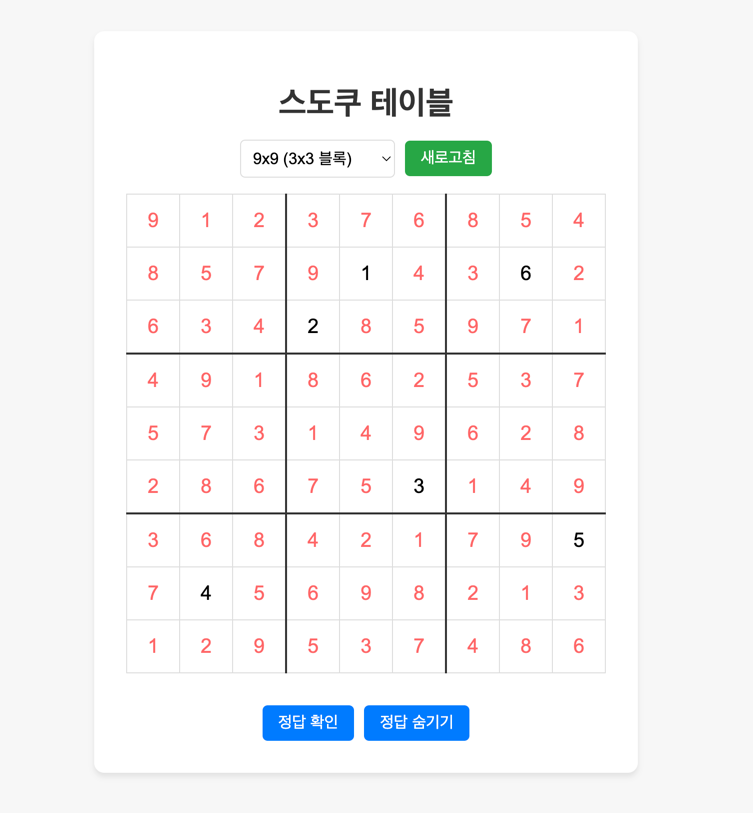

# Golang Sudoku Solution

Golang 을 이용해 스도쿠를 빠르고 정확하게 해결할 수 있는 솔루션

## Features

- 유효성 검사
    - 입력된 스도쿠 그리드에 문제가 없는지 확인
    - 행, 열, 블록에 중복된 숫자가 있는지 확인
    - 그리드 크기를 초과하는 숫자가 있는지 확인
- 스도쿠 해결
    - 전체 빈 칸을 확인하고 해당 빈 칸 기준으로 행, 열, 블록에 채워야하는 추가 빈 칸이 몇 개인지 확인
    - 빈 칸이 작은 것부터 순차적으로 확인하며 가능한 숫자를 찾아 채워넣음
    - 빈 칸이 없을 때까지 반복하며 모든 빈 칸이 채워지면 종료
- 성능 개선
    - 빈 칸이 적은 순서대로 채워넣는 방식으로 성능을 개선
    - 고루틴을 이용해서 병렬로 처리하여 속도를 높임

풀어야할 숙제

## Screenshots



## Tech Stack

- Frontend : HTML, CSS, Javascript
- Backend : Golang

## Try Demo

- [https://port-0-sudoku-go-lxpyfe9c0b3bec1d.sel5.cloudtype.app/](https://port-0-sudoku-go-lxpyfe9c0b3bec1d.sel5.cloudtype.app/)

(임시 빌드된 페이지로 접속이 되지 않을 수 있습니다)

## Install

1. git clone
```bash
git clone https://github.com/lee-lou2/sudoku-go.git
```

2. install golang modules
```bash
go mod tidy
```

3. run
```bash
go run .
```
